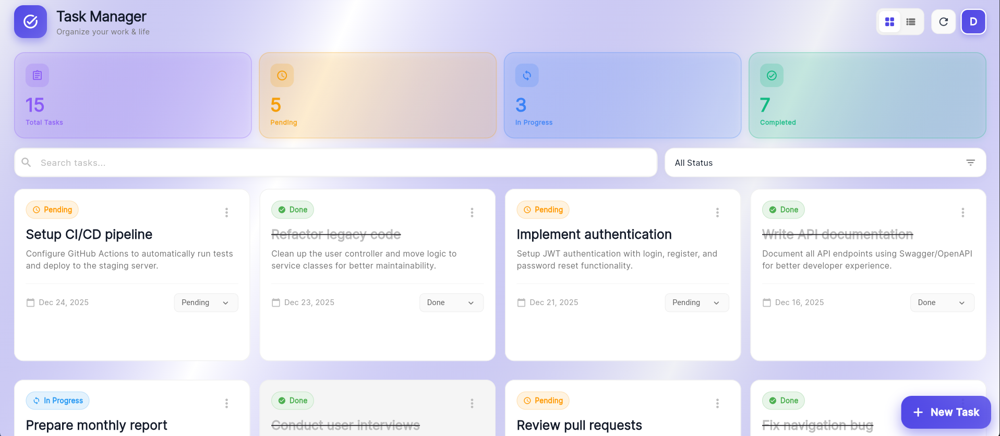
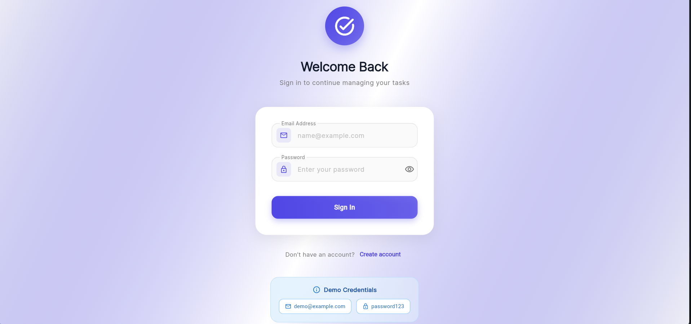
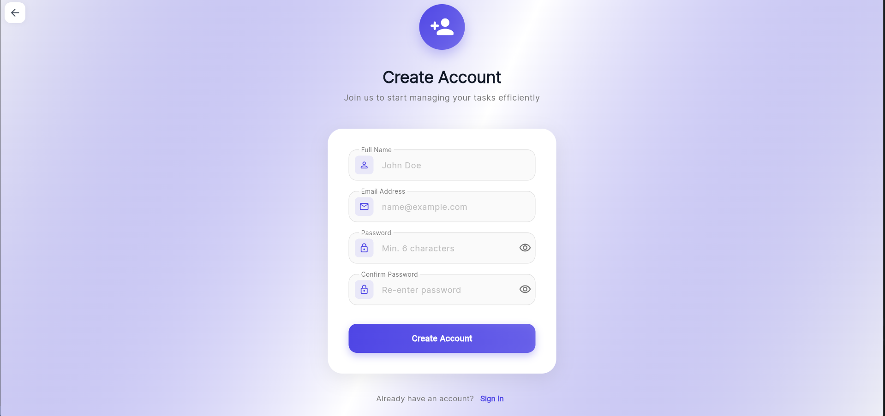

# 🚀 Task Management Application

<div align="center">


**A modern, full-stack task management application built for the Junior Software Engineer technical assessment**

[Features](#-features) • [Demo](#-demo) • [Installation](#-installation) • [API Docs](#-api-documentation) • [Screenshots](#-screenshots)

</div>

---

## 📋 Table of Contents

- [Overview](#-overview)
- [Features](#-features)
- [Demo Credentials](#-demo-credentials)
- [Tech Stack](#-tech-stack)
- [Screenshots](#-screenshots)
- [Installation](#-installation)
  - [Backend Setup](#backend-setup-laravel)
  - [Frontend Setup](#frontend-setup-flutter-web)
- [API Documentation](#-api-documentation)
- [Project Structure](#-project-structure)
- [Testing](#-testing)
- [Assumptions & Design Decisions](#-assumptions--design-decisions)
- [Future Enhancements](#-future-enhancements)

---

## 🎯 Overview

This is a full-stack task management application that allows users to create, organize, and track their tasks efficiently. The application features a modern, responsive UI with smooth animations, comprehensive task management capabilities, and secure JWT-based authentication.

**Built as part of a technical assessment to demonstrate:**
- Full-stack development skills (Backend + Frontend)
- RESTful API design principles
- Modern UI/UX implementation
- Security best practices (JWT, password hashing, user isolation)
- Clean code architecture
- Comprehensive documentation

---

## ✨ Features

### 🔐 Authentication
- ✅ User registration with validation
- ✅ Secure login with JWT tokens
- ✅ Token refresh mechanism
- ✅ Password hashing with bcrypt
- ✅ Protected routes and API endpoints

### 📝 Task Management
- ✅ Create, read, update, and delete tasks
- ✅ Task status management (Pending, In Progress, Done)
- ✅ Search tasks by title
- ✅ Filter tasks by status
- ✅ Task pagination with smooth loading
- ✅ User-specific task isolation
- ✅ Real-time task statistics dashboard

### 🎨 User Interface
- ✅ Modern, responsive design
- ✅ Smooth animations and transitions
- ✅ Grid/List view toggle
- ✅ Glassmorphic design elements
- ✅ Loading states and error handling
- ✅ Empty state illustrations
- ✅ Toast notifications for actions
- ✅ Mobile-responsive layout

### 🛡️ Security
- ✅ JWT token-based authentication
- ✅ Password confirmation on registration
- ✅ User data isolation (users only see their own tasks)
- ✅ Input validation on frontend and backend
- ✅ CORS protection
- ✅ SQL injection protection via Eloquent ORM

---

## 🎮 Demo Credentials

You can test the application using these credentials:

```
Email: demo@example.com
Password: password123
```

Or create your own account through the registration page!

---

## 🛠️ Tech Stack

### Backend
- **Framework:** Laravel 12
- **Authentication:** JWT (tymon/jwt-auth)
- **Database:** MySQL 8.0 / SQLite
- **API:** RESTful with JSON responses
- **Testing:** Pest PHP

### Frontend
- **Framework:** Flutter Web
- **State Management:** Provider
- **HTTP Client:** Dio / HTTP package
- **Storage:** Shared Preferences
- **UI:** Material Design 3

### DevOps
- **Version Control:** Git
- **Package Manager:** Composer (Backend), Pub (Frontend)
- **Environment:** PHP 8.2+, Flutter 3.x

---

## 📸 Screenshots

<div align="center">

### 🏠 Dashboard - Grid View

*Modern dashboard with statistics and grid layout*

### 📋 Dashboard - List View

*Alternative list view for detailed task information*

### 🔐 Authentication
<table>
  <tr>
    <td align="center">
      
      <br />
      <sub><b>Login Screen</b></sub>
    </td>
    <td align="center">
      
      <br />
      <sub><b>Registration Screen</b></sub>
    </td>
  </tr>
</table>

### 📝 Task Management
<table>
  <tr>
    <td align="center">
      
      <br />
      <sub><b>Create Task Dialog</b></sub>
    </td>
    <td align="center">
      
      <br />
      <sub><b>Task Details & Edit</b></sub>
    </td>
  </tr>
</table>

### 📊 Features Showcase
<table>
  <tr>
    <td align="center">
      
      <br />
      <sub><b>Search & Filter</b></sub>
    </td>
    <td align="center">
      
      <br />
      <sub><b>Task Statistics</b></sub>
    </td>
  </tr>
</table>

</div>

---

## 🚀 Installation

### Prerequisites

Before you begin, ensure you have the following installed:

- **PHP** >= 8.2
- **Composer** (latest version)
- **MySQL** 8.0+ or **SQLite**
- **Flutter** SDK 3.x+
- **Git**

---

### Backend Setup (Laravel)

#### 1️⃣ Clone the Repository

```bash
git clone https://github.com/yourusername/task-management-app.git
cd task-management-app
```

#### 2️⃣ Navigate to Backend Directory

```bash
cd backend
```

#### 3️⃣ Install PHP Dependencies

```bash
composer install
```

#### 4️⃣ Environment Configuration

```bash
# Copy environment file
cp .env.example .env

# Generate application key
php artisan key:generate

# Generate JWT secret
php artisan jwt:secret
```

#### 5️⃣ Configure Database

**Option A: MySQL (Recommended for Production)**

Edit `.env` file:

```env
DB_CONNECTION=mysql
DB_HOST=127.0.0.1
DB_PORT=3306
DB_DATABASE=task_management
DB_USERNAME=root
DB_PASSWORD=your_password
```

Create the database:
```bash
mysql -u root -p -e "CREATE DATABASE task_management;"
```

**Option B: SQLite (Easier for Testing)**

Edit `.env` file:

```env
DB_CONNECTION=sqlite
DB_DATABASE=/absolute/path/to/database/database.sqlite
```

Create the database file:
```bash
touch database/database.sqlite
```

#### 6️⃣ Run Migrations

```bash
php artisan migrate
```

#### 7️⃣ (Optional) Seed Demo Data

```bash
php artisan db:seed
```

This creates a demo user:
- Email: `demo@example.com`
- Password: `password123`

#### 8️⃣ Start the Development Server

```bash
php artisan serve
```

✅ Backend API is now running at: **http://localhost:8000**

#### 9️⃣ Test the API

```bash
curl http://localhost:8000/api/health
```

Expected response:
```json
{
  "status": "ok",
  "message": "Task Management API is running"
}
```

---

### Frontend Setup (Flutter Web)

#### 1️⃣ Navigate to Frontend Directory

```bash
cd ../frontend
```

#### 2️⃣ Install Flutter Dependencies

```bash
flutter pub get
```

#### 3️⃣ Configure API Base URL

Edit `lib/services/api_service.dart` and update the base URL if needed:

```dart
static const String baseUrl = 'http://localhost:8000/api';
```

#### 4️⃣ Run Flutter Web Application

```bash
# Development mode
flutter run -d chrome

# Or build for production
flutter build web
```

✅ Frontend is now running at: **http://localhost:xxxx** (port will be shown in terminal)

---

## 📖 API Documentation

### Base URL

```
http://localhost:8000/api
```

### Response Format

All API responses follow this consistent structure:

```json
{
    "success": true,
    "message": "Operation message",
    "data": { ... }
}
```

---

### 🔐 Authentication Endpoints

#### Register User

```http
POST /api/register
Content-Type: application/json
```

**Request Body:**
```json
{
    "name": "John Doe",
    "email": "john@example.com",
    "password": "password123",
    "password_confirmation": "password123"
}
```

**Success Response (201):**
```json
{
    "success": true,
    "message": "User registered successfully",
    "data": {
        "user": {
            "id": 1,
            "name": "John Doe",
            "email": "john@example.com",
            "created_at": "2024-12-28T19:24:00.000000Z"
        },
        "token": "eyJ0eXAiOiJKV1QiLCJhbGci...",
        "token_type": "bearer",
        "expires_in": 3600
    }
}
```

---

#### Login User

```http
POST /api/login
Content-Type: application/json
```

**Request Body:**
```json
{
    "email": "john@example.com",
    "password": "password123"
}
```

**Success Response (200):**
```json
{
    "success": true,
    "message": "Login successful",
    "data": {
        "user": { ... },
        "token": "eyJ0eXAiOiJKV1QiLCJhbGci...",
        "token_type": "bearer",
        "expires_in": 3600
    }
}
```

---

#### Get Current User

```http
GET /api/me
Authorization: Bearer {token}
```

---

#### Logout

```http
POST /api/logout
Authorization: Bearer {token}
```

---

#### Refresh Token

```http
POST /api/refresh
Authorization: Bearer {token}
```

---

### 📝 Task Endpoints

> **Note:** All task endpoints require authentication header: `Authorization: Bearer {token}`

#### List Tasks (with Pagination)

```http
GET /api/tasks?page=1&per_page=15&status=pending&search=project
Authorization: Bearer {token}
```

**Query Parameters:**

| Parameter | Type | Default | Description |
|-----------|------|---------|-------------|
| `page` | integer | 1 | Page number |
| `per_page` | integer | 15 | Items per page (max: 100) |
| `status` | string | - | Filter: `pending`, `in_progress`, `done` |
| `search` | string | - | Search in task titles |
| `sort_by` | string | `created_at` | Sort field |
| `sort_order` | string | `desc` | Sort order: `asc`, `desc` |

**Success Response (200):**
```json
{
    "success": true,
    "data": {
        "tasks": [
            {
                "id": 1,
                "title": "Complete project documentation",
                "description": "Write comprehensive API docs",
                "status": "pending",
                "created_at": "2024-12-28T19:24:00.000000Z",
                "updated_at": "2024-12-28T19:24:00.000000Z"
            }
        ],
        "pagination": {
            "current_page": 1,
            "last_page": 3,
            "per_page": 15,
            "total": 42,
            "from": 1,
            "to": 15
        }
    }
}
```

---

#### Create Task

```http
POST /api/tasks
Authorization: Bearer {token}
Content-Type: application/json
```

**Request Body:**
```json
{
    "title": "New Task Title",
    "description": "Optional task description",
    "status": "pending"
}
```

**Validation Rules:**
- `title`: required, string, max 255 characters
- `description`: optional, string, max 1000 characters
- `status`: optional, enum (`pending`, `in_progress`, `done`)

---

#### Get Single Task

```http
GET /api/tasks/{id}
Authorization: Bearer {token}
```

---

#### Update Task

```http
PUT /api/tasks/{id}
Authorization: Bearer {token}
Content-Type: application/json
```

**Request Body (all fields optional):**
```json
{
    "title": "Updated Title",
    "description": "Updated description",
    "status": "done"
}
```

---

#### Delete Task

```http
DELETE /api/tasks/{id}
Authorization: Bearer {token}
```

**Success Response (200):**
```json
{
    "success": true,
    "message": "Task deleted successfully"
}
```

---

#### Get Task Statistics

```http
GET /api/tasks/stats
Authorization: Bearer {token}
```

**Success Response (200):**
```json
{
    "success": true,
    "data": {
        "stats": {
            "total": 42,
            "pending": 15,
            "in_progress": 10,
            "done": 17
        }
    }
}
```

---

### ❌ Error Responses

#### Validation Error (422)
```json
{
    "success": false,
    "message": "Validation failed",
    "errors": {
        "title": ["The title field is required."],
        "email": ["The email has already been taken."]
    }
}
```

#### Unauthorized (401)
```json
{
    "message": "Unauthenticated."
}
```

#### Not Found (404)
```json
{
    "success": false,
    "message": "Task not found"
}
```

#### Server Error (500)
```json
{
    "success": false,
    "message": "Internal server error"
}
```

---

## 📂 Project Structure

```
task-management-app/
├── backend/                          # Laravel Backend
│   ├── app/
│   │   ├── Http/
│   │   │   └── Controllers/
│   │   │       └── Api/
│   │   │           ├── AuthController.php       # Authentication logic
│   │   │           └── TaskController.php       # Task CRUD operations
│   │   └── Models/
│   │       ├── User.php                         # User model with JWT
│   │       └── Task.php                         # Task model
│   ├── config/
│   │   ├── auth.php                             # Auth guards (JWT)
│   │   ├── cors.php                             # CORS configuration
│   │   └── jwt.php                              # JWT settings
│   ├── database/
│   │   ├── factories/
│   │   │   ├── UserFactory.php
│   │   │   └── TaskFactory.php
│   │   ├── migrations/
│   │   │   ├── 2024_xx_xx_create_users_table.php
│   │   │   └── 2024_xx_xx_create_tasks_table.php
│   │   └── seeders/
│   │       └── DatabaseSeeder.php               # Demo data seeder
│   ├── routes/
│   │   └── api.php                              # API routes
│   ├── tests/
│   │   └── Feature/
│   │       ├── AuthTest.php                     # Authentication tests
│   │       └── TaskTest.php                     # Task CRUD tests
│   ├── .env.example                             # Environment template
│   ├── composer.json                            # PHP dependencies
│   └── README.md
│
└── frontend/                         # Flutter Web Frontend
    ├── lib/
    │   ├── main.dart                            # App entry point
    │   ├── models/
    │   │   ├── user.dart                        # User model
    │   │   └── task.dart                        # Task model
    │   ├── providers/
    │   │   ├── auth_provider.dart               # Auth state management
    │   │   └── task_provider.dart               # Task state management
    │   ├── screens/
    │   │   ├── login_screen.dart                # Login UI
    │   │   ├── register_screen.dart             # Registration UI
    │   │   └── tasks_screen.dart                # Main task dashboard
    │   ├── services/
    │   │   ├── api_service.dart                 # HTTP client wrapper
    │   │   └── auth_service.dart                # Token management
    │   └── widgets/
    │       ├── task_card.dart                   # Task card component
    │       └── task_form.dart                   # Task form dialog
    ├── pubspec.yaml                             # Flutter dependencies
    └── README.md
```

---

## 🧪 Testing

### Backend Tests (Laravel)

Run the full test suite:

```bash
cd backend

# Run all tests
php artisan test

# Run with coverage
php artisan test --coverage

# Run specific test file
php artisan test tests/Feature/AuthTest.php
php artisan test tests/Feature/TaskTest.php

# Run tests with detailed output
php artisan test --parallel
```

**Test Coverage:**
- ✅ User registration with validation
- ✅ User login with credentials
- ✅ Token refresh mechanism
- ✅ Task CRUD operations
- ✅ Task filtering and search
- ✅ User isolation (tasks belong to users)
- ✅ Authorization checks

---

## 💭 Assumptions & Design Decisions

### Backend Decisions

1. **JWT Authentication**: Chose JWT over session-based auth for stateless API design, enabling easier scaling and mobile app support in the future.

2. **Task Status Enum**: Limited to three statuses (`pending`, `in_progress`, `done`) for simplicity. This can be easily extended to support custom statuses.

3. **Soft Deletes**: Not implemented to keep the database simple. Can be added by using Laravel's `SoftDeletes` trait if needed.

4. **Pagination**: Default 15 items per page with a maximum of 100 to balance performance and UX.

5. **CORS Configuration**: Configured to allow all origins in development. Should be restricted to specific domains in production.

### Frontend Decisions

1. **Flutter Web over React**: Chose Flutter Web to demonstrate proficiency in Flutter while still delivering a web application. Flutter Web provides excellent performance and smooth animations.

2. **Provider for State Management**: Selected Provider over other solutions (Bloc, Riverpod) for its simplicity and developer-friendly API, suitable for this app's scope.

3. **Token Storage**: Using `shared_preferences` for token persistence. Tokens are stored securely and cleared on logout.

4. **Grid/List Toggle**: Added view switching to enhance UX and demonstrate advanced UI implementation.

5. **Animations**: Implemented staggered animations and micro-interactions to create a premium feel without over-engineering.

### General Assumptions

- Single-user environment (no task sharing or collaboration features)
- Tasks are personal and private to each user
- No file attachments or rich text in task descriptions
- English language only (no i18n)
- Modern browser support (Chrome, Firefox, Safari, Edge)

---

## 🚀 Future Enhancements

If given more time, these features could be added:

### High Priority
- [ ] Docker containerization for easy deployment
- [ ] Task due dates and reminders
- [ ] Task priority levels (High, Medium, Low)
- [ ] Task categories/labels
- [ ] Email verification on registration
- [ ] Password reset functionality

### Medium Priority
- [ ] Task attachments (file uploads)
- [ ] Task comments/notes
- [ ] Task sharing between users
- [ ] Activity log/history
- [ ] Export tasks (CSV, PDF)
- [ ] Dark mode theme

### Low Priority
- [ ] Mobile app (Flutter iOS/Android)
- [ ] Real-time updates (WebSockets)
- [ ] Task templates
- [ ] Recurring tasks
- [ ] Advanced analytics dashboard
- [ ] Integration with calendar apps

---

## 🔧 Configuration

### Environment Variables

#### Backend (.env)

```env
# Application
APP_NAME="Task Management API"
APP_ENV=local
APP_KEY=base64:...
APP_DEBUG=true
APP_URL=http://localhost:8000

# Database
DB_CONNECTION=mysql
DB_HOST=127.0.0.1
DB_PORT=3306
DB_DATABASE=task_management
DB_USERNAME=root
DB_PASSWORD=

# JWT Configuration
JWT_SECRET=...
JWT_TTL=60                    # Token lifetime (minutes)
JWT_REFRESH_TTL=20160         # Refresh window (14 days)

# CORS
FRONTEND_URL=http://localhost:3000
```

#### Frontend

Update `lib/services/api_service.dart`:

```dart
class ApiService {
  static const String baseUrl = 'http://localhost:8000/api';
  
  // For production:
  // static const String baseUrl = 'https://your-api-domain.com/api';
}
```

---

## 🐛 Troubleshooting

### Common Issues

#### 1. CORS Error
**Problem:** Frontend can't connect to backend API

**Solution:**
- Ensure `FRONTEND_URL` in backend `.env` matches your frontend URL
- Clear config cache: `php artisan config:clear`
- Restart Laravel server

#### 2. JWT Token Invalid
**Problem:** "Token Signature could not be verified"

**Solution:**
- Run `php artisan jwt:secret` to regenerate JWT secret
- Clear cache: `php artisan config:clear`
- Logout and login again in frontend

#### 3. Database Connection Failed
**Problem:** Can't connect to database

**Solution:**
- Verify database credentials in `.env`
- Ensure MySQL is running: `sudo service mysql status`
- Check database exists: `mysql -u root -p -e "SHOW DATABASES;"`

#### 4. Flutter Build Error
**Problem:** Flutter web build fails

**Solution:**
```bash
flutter clean
flutter pub get
flutter pub upgrade
flutter run -d chrome
```

---

## 📝 Development Notes

### Code Quality
- **PSR-12** coding standard for Laravel backend
- **Dart Effective Style** for Flutter frontend
- **PHPDoc** comments on all controller methods
- **Dart Doc** comments on public APIs

### Security Considerations
- Passwords hashed with bcrypt (cost factor: 12)
- SQL injection prevention via Eloquent ORM
- XSS protection with Laravel's built-in sanitization
- CSRF protection on state-changing operations
- Rate limiting on authentication endpoints (recommended for production)

---

## 📄 License

This project is open-sourced software licensed under the [MIT license](https://opensource.org/licenses/MIT).

---

## 👨‍💻 Author

**[Your Name]**
- Email: [your.email@example.com]
- LinkedIn: [your-linkedin-profile]
- GitHub: [@yourusername](https://github.com/yourusername)

---

## 🙏 Acknowledgments

Built as part of the Junior Software Engineer technical assessment for Rawmart App. Thank you for the opportunity!

---

<div align="center">

**⭐ If you found this project helpful, please consider giving it a star!**

Made with ❤️ using Laravel & Flutter

</div>
